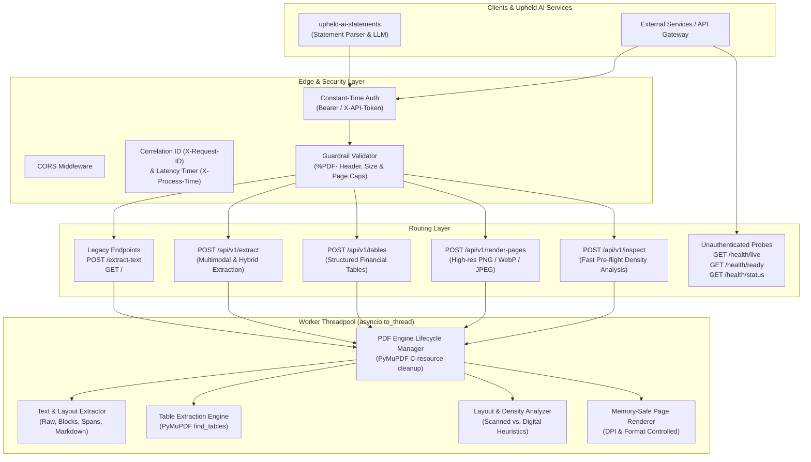

# Upheld AI PDF Extract (`upheld-ai-pdf-extract`)

[](#architecture)
[](#performance--benchmarks)
[](#legacy-compatibility-upheld-ai-statements)

Enterprise-grade, high-throughput PDF extraction and document intelligence microservice designed specifically for financial statements, bank records, invoices, and legal documents. It powers document ingestion for **`upheld-ai-statements`**.

---

## Table of Contents
- [Architectural Overview](#architectural-overview)
- [Key Production Enhancements](#key-production-enhancements)
- [Legacy Compatibility (`upheld-ai-statements`)](#legacy-compatibility-upheld-ai-statements)
- [Modern API (v1) Reference](#modern-api-v1-reference)
  - [`POST /api/v1/extract`](#post-apiv1extract)
  - [`POST /api/v1/tables`](#post-apiv1tables)
  - [`POST /api/v1/render-pages`](#post-apiv1render-pages)
  - [`POST /api/v1/inspect`](#post-apiv1inspect)
  - [Postman Collection](#postman-collection)
- [Deployment & Operations](#deployment--operations)
  - [Local Development](#1-local-development)
  - [Production Deployment](#2-production-deployment)
  - [Configuration Reference](#configuration-reference)

---

## Architectural Overview



---

## Key Production Enhancements

| Feature | Legacy Implementation | Production Re-Architecture |
| :--- | :--- | :--- |
| **Event Loop Safety** | Synchronous C execution directly inside `async def` route, starving the FastAPI event loop during heavy renders. | All CPU-bound MuPDF operations offloaded to background thread workers via `asyncio.to_thread`. |
| **Scanned Fallback** | All-or-nothing: if 1 page had selectable text, 0 pages were rendered as images—breaking hybrid statements. | Per-page scan density heuristics (`digital`, `scanned`, `hybrid`). Renders images conditionally or on-demand. |
| **Financial Tables** | Ignored tabular grids; columns were flattened or interleaved in plain text. | PyMuPDF `find_tables()` integration extracting structured row/col matrices, bounding boxes, and Markdown tables. |
| **Memory Management** | Pixmap memory leaks on exceptions; holding all base64 strings simultaneously in RAM. | Deterministic `with PDFEngine.open_pdf()` lifecycle manager; buffer disposal. |
| **Security Guardrails** | No magic byte verification; vulnerable to decompression bombs. | `%PDF-` header validation, maximum file size cap (`MAX_FILE_SIZE_MB`), page count limits (`MAX_PAGES`). |
| **Deployment** | Single script running uvicorn standalone without process management. | Multi-worker production Gunicorn configuration (`gunicorn_conf.py`) with `UvicornWorker` processes and automatic worker recycling. |

---

## Legacy Compatibility (`upheld-ai-statements`)

`upheld-ai-pdf-extract` maintains **100% backward compatibility** with existing consumers:

### `GET /`
Returns exact status payload:
```json
{
  "status": "ok",
  "service": "PyMuPDF PDF Text Extractor",
  "port": 8020,
  "supports_rendered_pages": true
}
```

### `POST /extract-text`
Multipart form upload accepted by `upheld-ai-statements`:
- `file`: PDF file upload.
- `password`: (Optional) PDF password if encrypted.
- Authentication: `Authorization: Bearer <API_TOKEN>` or `X-API-Token: <API_TOKEN>`.

Returns exact legacy response structure:
```json
{
  "text": "Normalized extracted text across all pages...",
  "page_count": 5,
  "selectable_pages": 5,
  "selectable_text": true,
  "source": "pymupdf",
  "rendered_pages": []
}
```

---

## Modern API (v1) Reference

### `POST /api/v1/extract`
Multimodal extraction designed for statement ingestion pipelines.

**Form Parameters**:
- `file` (*required*): UploadFile
- `password` (*optional*): Decryption password
- `mode` (*optional*): `text`, `layout`, `tables`, `hybrid`, `images`, or `full` (default: `full`)
- `pages` (*optional*): Comma-separated page range (e.g., `"1-3,5"`). Omit to extract all.
- `extract_tables` (*optional*, bool, default `true`): Extract tabular data grids
- `extract_blocks` (*optional*, bool, default `false`): Include bounding box coordinates per text block
- `render_images` (*optional*, bool, default `false`): Force image rendering
- `dpi` (*optional*, int, default `150`): Rendering resolution (max 300)
- `image_format` (*optional*): `png`, `jpeg`, or `webp`

**Response Example**:
```json
{
  "status": "success",
  "document_name": "chase_bank_statement.pdf",
  "page_count": 4,
  "selectable_pages": 4,
  "scanned_pages": 0,
  "overall_classification": "digital",
  "metadata": {
    "title": "Chase Account Statement",
    "is_encrypted": false,
    "page_count": 4,
    "file_size_bytes": 1048576
  },
  "full_text": "...",
  "full_markdown": "## Page 1\n\n### Account Summary\n\n| Date | Description | Amount | Balance |\n| --- | --- | --- | --- |\n| 01/15/2026 | Direct Deposit | $3,500.00 | $7,250.00 |",
  "pages": [
    {
      "page_number": 1,
      "text": "...",
      "classification": "digital",
      "analysis": {
        "page_number": 1,
        "width": 595.0,
        "height": 842.0,
        "character_count": 1420,
        "word_count": 210,
        "classification": "digital",
        "has_selectable_text": true,
        "image_count": 1,
        "table_count": 1
      },
      "tables": [
        {
          "table_id": 1,
          "page_number": 1,
          "row_count": 15,
          "col_count": 4,
          "headers": ["Date", "Description", "Amount", "Balance"],
          "rows": [["01/15/2026", "Direct Deposit Payroll", "$3,500.00", "$7,250.00"]],
          "markdown": "| Date | Description | Amount | Balance |\n| --- | --- | --- | --- |\n| 01/15/2026 | Direct Deposit Payroll | $3,500.00 | $7,250.00 |"
        }
      ]
    }
  ],
  "processing_time_ms": 42.15
}
```

---

### `POST /api/v1/tables`
Dedicated endpoint returning structured financial transaction tables.
- **Parameters**: `file`, `password`, `pages`
- **Output**: Array of extracted tables with row/col matrices and markdown representations.

---

### `POST /api/v1/render-pages`
Dedicated high-resolution rasterizer for Vision LLM (VLM) pipelines (GPT-4o, Claude 3.5 Sonnet, Gemini 1.5/2.0 Pro).
- **Parameters**: `file`, `password`, `pages`, `dpi` (150-300), `format` (`png`, `jpeg`, `webp`).
- **Output**: Array of rendered pages with base64 data, byte size, and dimensions.

---

### `POST /api/v1/inspect`
Fast, lightweight pre-flight inspection without rendering:
- Returns page count, encryption state, and scan density.
- Recommends optimal extraction mode (`digital`, `hybrid`, or `images`).

---

## Postman Collection

Pre-configured Postman files are included in the repository root for instantaneous testing:
- **Collection**: [`postman_collection.json`](postman_collection.json) (covers all legacy and modern v1 endpoints with file upload presets)
- **Environment**: [`postman_environment.json`](postman_environment.json) (pre-configured with `baseUrl = http://localhost:8020` and `apiToken = TESTAPIKEK`)

### How to Import & Use:
1. Open **Postman**.
2. Click **Import** (top left).
3. Select both `postman_collection.json` and `postman_environment.json`.
4. In the top-right environment selector, choose **"Upheld AI PDF Extract (Local)"**.
5. Select any request (e.g. `POST /api/v1/extract`), attach your sample PDF in the **Body -> form-data -> file** field, and click **Send**.

## Document Intelligence for Statements

Financial and operational bank statements require specialized parsing:

1. **Table Detection**: Multi-column transaction tables (Date, Description, Withdrawals, Deposits, Balance) are preserved as discrete rows and cells rather than flattened strings.
2. **Hybrid PDF Awareness**: Documents where the cover letter is digital but check copies or transaction appendices are scanned are automatically flagged with `PageClassification.HYBRID` or `PageClassification.SCANNED`.
3. **Markdown Representation**: Preserves semantic hierarchy (`### Header`, tables, paragraphs) for optimal ingestion by downstream LLMs.

---

## Performance & Concurrency Protection

- **Threadpool Offload**: PyMuPDF C calls release the Python GIL during heavy operations, allowing multi-core CPU utilization via `asyncio.to_thread`.
- **Gunicorn Concurrency**: Production deployment uses Gunicorn with `uvicorn.workers.UvicornWorker` processes.
- **Memory Recycling**: Gunicorn worker recycling (`max_requests = 1000`) prevents long-running C-heap fragmentation.

---

## Deployment & Operations

For complete deployment architectures (including Kubernetes YAML manifests and Linux systemd service configurations), see the dedicated [RUNNING.md](RUNNING.md) guide.

### 1. Local Development

#### Setup & Run with Hot Reload
```bash
# 1. Create and activate Python 3.11 virtual environment
python3 -m venv .venv
source .venv/bin/activate

# 2. Install dependencies
pip install -r requirements.txt
pip install pytest httpx

# 3. Configure environment
cp .env.example .env
# Edit .env with your API_TOKEN (e.g. API_TOKEN=TESTAPIKEK)

# 4. Start local development server with hot-reload
uvicorn app.main:app --host 0.0.0.0 --port 8020 --reload

# Or use the legacy entry point:
python app.py

# Or via Makefile:
make dev
```

The interactive OpenAPI Swagger UI will be live at:
`http://localhost:8020/docs`

#### Run Tests
```bash
pytest -v
```

---

### 2. Production Deployment

#### Multi-Worker Gunicorn (Recommended)
Run with multi-worker Gunicorn using `UvicornWorker` processes:
```bash
# Activate production venv
source .venv/bin/activate

# Launch Gunicorn with production configuration
gunicorn -c gunicorn_conf.py app.main:app

# Or via Makefile:
make run-prod
```
*`gunicorn_conf.py` automatically configures `(2 * CPU) + 1` worker processes, 120s timeout, and worker recycling (`max_requests = 1000`) to prevent MuPDF C-heap fragmentation.*

#### Linux Systemd Service (Auto-Start Daemon)
Create `/etc/systemd/system/upheld-pdf-extract.service`:
```ini
[Unit]
Description=Upheld AI PDF Extract Microservice
After=network.target

[Service]
Type=simple
User=www-data
Group=www-data
WorkingDirectory=/opt/upheld-ai-pdf-extract
EnvironmentFile=/opt/upheld-ai-pdf-extract/.env
ExecStart=/opt/upheld-ai-pdf-extract/.venv/bin/gunicorn -c gunicorn_conf.py app.main:app
Restart=always
RestartSec=5s
LimitNOFILE=65536

[Install]
WantedBy=multi-user.target
```

Enable and start:
```bash
sudo systemctl daemon-reload
sudo systemctl enable upheld-pdf-extract
sudo systemctl start upheld-pdf-extract
```

### Configuration Reference

Configure via `.env` file or environment variables:

| Variable | Default | Description |
| :--- | :--- | :--- |
| `API_TOKEN` | *Required* | API key for authentication (comma-separated for key rotation). |
| `PORT` | `8020` | Server HTTP port. |
| `ENVIRONMENT` | `production` | Environment name (`development`, `staging`, `production`). |
| `MAX_FILE_SIZE_MB` | `50` | Maximum uploaded PDF file size in MB. |
| `MAX_PAGES` | `500` | Maximum page limit guardrail against PDF bombs. |
| `DEFAULT_RENDER_DPI`| `150` | Default DPI for rendered pages. |
| `MAX_RENDER_DPI` | `300` | Maximum allowed DPI cap. |
| `SCANNED_THRESHOLD_CHARS` | `100` | Minimum characters per page before flagging as scanned. |
| `CORS_ALLOWED_ORIGINS` | `*` | Allowed CORS origins (comma-separated). |
| `LOG_LEVEL` | `INFO` | Logging level (`DEBUG`, `INFO`, `WARNING`, `ERROR`). |
